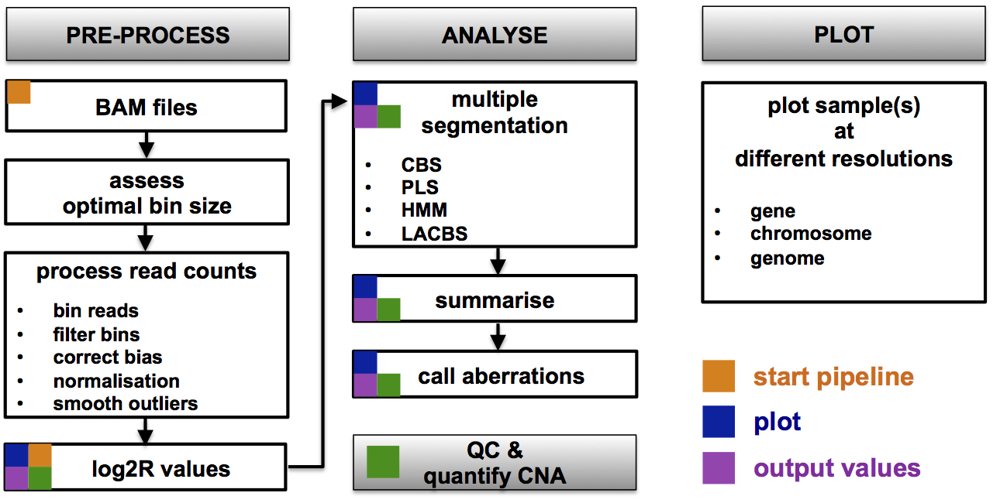
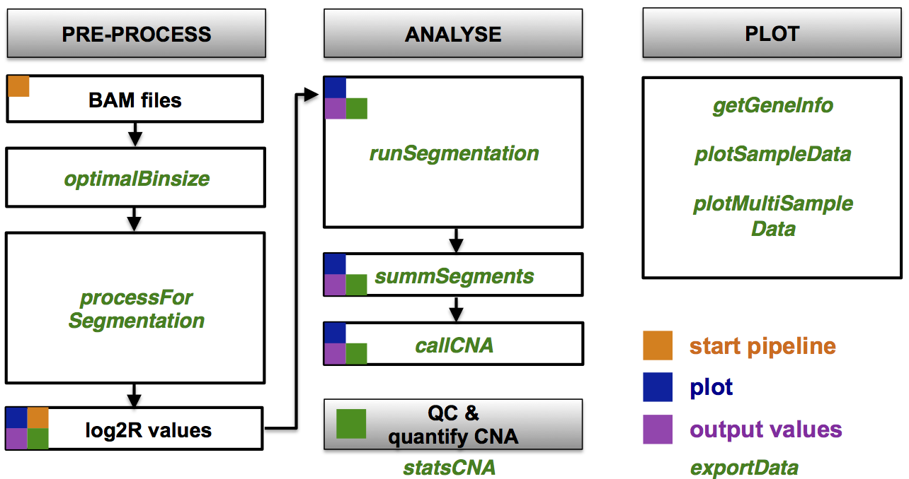

------------------------------------------------------------------------

title: "CNAclinic" author: Dineika Chandrananda date: Nov 1, 2017 output: github\_document ---

CNAclinic: An R package for end-to-end copy number analysis from shallow whole-genome sequencing
================================================================================================

Installation within R
---------------------

``` r
# Install annotation packages
source("https://bioconductor.org/biocLite.R")
biocLite(c("org.Hs.eg.db, TxDb.Hsapiens.UCSC.hg19.knownGene, TxDb.Hsapiens.UCSC.hg38.knownGene", "QDNAseq.hg19"))

# Installing CNAclinic
install.packages("devtools")

library(devtools)

install_github("sdchandra/CNAclinic", build_vignettes = TRUE, dependencies=TRUE)

library(CNAclinic)
```

Tutorial
--------



This is a detailed tutorial on the use and functionality of `CNAclinic`. This package provides an end-to-end pipeline for copy number aberration (CNA) analysis of shallow coverage whole-genome sequencing (sWGS) data (&lt; 0.5X). sWGS is an attractive option for diagnostic settings and clinical research as it drastically reduces the sequencing time and data-storage requirements. However, a bottleneck exists between the generation of sWGS data and the ability to easily carry out a robust analysis. While there are multitudes of software for copy number analysis of high-coverage WGS data, most do not pay adequate attention to issues that are either specific to or more crucial for the sparse counts generated in sWGS.

`CNAclinic` allows the user to carry out an analysis of CNA providing functionality tailored for sWGS as well as the capacity for multi-faceted visualization and data interrogation. For more details, please see the associated manuscript.

Input into `CNAclinic` can either be BAM files containing aligned, sorted and duplicate marked reads or normalized and log-transformed copy number values. Figures 1 & 2 provide an overview of the package and lists the functions utilised in its workflow.



Example data
------------

The package contains an example dataset (`exData`) that is used in the tutorial. The data originates from a study by Piskorz et al.(2016), deposited in the European Genome-phenome Archive under accession number `EGAD00001001938`.

-   The data comes from 10 patients with high-grade serous ovarian cancer (HGSOC).

-   Each patient had 3 biopsy samples (Bx) taken from their tumour tissue.

-   The 3 DNA samples were either snap frozen (SF) with liquid nitrogen, fixed in 10% neutral-buffered formalin (NBF) or universal molecular fixative (UMFIX).

-   Subsequent sWGS produced 50bp single-end reads (downsampled to approx. 5 million per sample).

### Example data format

`exData` contains copy number values (as *l**o**g*<sub>2</sub> ratios) of the 30 samples, binned in 50 Kbp genomic windows. The copy number values were generated using the pre-processing module of `CNAclinic`.

The input data is organized as a `data.frame` where each row represents a genomic bin, and the first 3 columns give the `chromosome`, `start` and `end` coordinates. The 4th column named `usebin` is an optional logical vector and can control if the particular genomic region is to be filtered from downstream analysis or not. Subsequent columns hold the *l**o**g*<sub>2</sub> ratios for each sample, and the header of these sample columns is a unique sample identifier.

``` r
# Load package 
library(CNAclinic)
```

    ## 

``` r
# Load and examine example data
data(exData)

row.names(exData) <- NULL
exData[100:105, 1:10]
```

    ##     chromosome   start     end usebin   P16_SF_Bx P5_UMFIX_Bx   P8_NBF_Bx
    ## 100          1 4950001 5000000   TRUE -0.04016085 -0.20693757 -0.02213217
    ## 101          1 5000001 5050000   TRUE -0.30988601 -0.35229161 -0.14523612
    ## 102          1 5050001 5100000   TRUE  0.15255526 -0.12946720 -0.01523683
    ## 103          1 5100001 5150000   TRUE  0.08303032 -0.09432175 -0.16664930
    ## 104          1 5150001 5200000   TRUE -0.10172071 -0.36908909 -0.18101900
    ## 105          1 5200001 5250000   TRUE -0.25598616 -0.18726039 -0.36608910
    ##      P5_NBF_Bx  P4_NBF_Bx P9_UMFIX_Bx
    ## 100 -0.4471100 -0.4221499  0.29776466
    ## 101 -0.1755694 -0.2954516 -0.12365634
    ## 102 -0.1127774 -0.2414255 -0.20134173
    ## 103 -0.4149346 -0.4423167  0.05131631
    ## 104 -0.5644799 -0.2517077 -0.34244570
    ## 105 -0.5564858 -0.3289683 -0.10674829

The package also contains an object (named `CNAData`) that holds the results of processing `exData`. This is a `CNAclinicData` object and will be detailed in a later section.

Assessing optimal binsize
-------------------------

The `optimalBinsize` function of `CNAclinic` utilizes the model selection method described in Gusnanto et al. (2014) to asesss the optimal window size for each data set using either the Akaike’s information criterion (AIC) or cross-validation (CV) log-likelihood. The function plots the AIC or CV curves as a function of genomic bin size, allowing the user to estimate the optimal value that minimizes AIC or maximizes CV log-likelihood.

**As a guidance, choose bin sizes which have high CV (low AIC) values but also contain 30-180 read counts on average. This strikes a reasonable balance between error variability and bias of CNA**.


``` r
# The function will read in all files ending in .bam from the 
# current directory and test window sizes of 
# 10, 30, 50, 100, 250, 500, 750, 1000 Kb by default.

plotList <- optimalBinsize()

# The function returns a list of ggplot objects 
# which can be further  manipulated.
# Here we change the default title for the 2nd sample
plotList[[3]] <- plotList[[3]] + 
    ggtitle("Patient 5 biopsy sample fixed with UMFIX")

# Different ways of utilising function:
# Set path to a subdirectory where all files
# ending in .bam will be read in
plotList <- optimalBinsize(path="/path/to/data/")
```

``` r
# Or 
# The user can provide paths to specific BAM files & 
# rename them
bamfiles <- c("path/to/case1.bam", "path/to/case2.bam", 
              "path/to/case3.bam", "path/to/case4.bam")
bamnames <- c("P5_UMFIX_Bx", "P8_SF_Bx", 
              "P11_NBF_Bx", "P8_SF_Bx")
plotList <- optimalBinsize(bamfiles, bamnames)

# And 
# The user can specify the bin sizes as well as 
# the measure used to compare the different sizes (CV or AIC)
# Plots can be saved to the current directory as .pdf files.

plotList <- optimalBinsize(bamfiles, bamnames, 
              binSizes=c(5, 10, 25, 50, 100, 200, 400), 
              measure="AIC", 
              savePlot=TRUE)


# Saving plots to a pdf as 2 x 2 plots per page
ml <- gridExtra::marrangeGrob(plotList, 
                   nrow=2, 
                   ncol=2, top=NULL)
        
ggsave(paste0("optimalBinsize.pdf"), ml)
```

With a cohort of samples that are to be analysed in one go, choose a bin size that is in the optimal range for all datasets in cohort. Consider downsampling sequencing reads such that all samples in the cohort have relatively similar total read counts.

``` r
# The first plot in the list returned by the function shows 
# the average counts per bin 
plotList <- optimalBinsize(bamfiles, bamnames)

plotList[[1]] 
```


Process BAM files
=================

Once the bin size has been decided the next step is to load and process the sequencing data from BAM files. The `processForSegmentation()` function is a wrapper that runs multiple read count pre-processing steps from the `QDNAseq` package described in Scheinin et al.

This function provides multiple arguments (see ?processForSegmentation) that allow the user to skip certain steps to tailor the pre-processing to better suit the input data. The function can return an object of class `CNAclinicData` (default) or `QDNAseqReadCounts` that contain genomic bin information and copy number measurements of each sample as log ratios.

``` r
# Similar to the optimalBinsize function, there are multiple ways 
# of reading in files 
# 1) read all files ending in .bam from the current working directory 
# Or
# 2) read all .bam files from a subdirectory given its path
# Or
# 3) read in specific BAMs given separate file paths 

# This example will only consider option 3.

# The user can provide paths to specific BAM files & rename them
# Each sample will be considered separately and will be normalized 
# to its own median

bamfiles <- c("path/to/tumour_A.bam", 
              "path/to/tumour_B.bam",
              "path/to/control_A.bam",
              "path/to/control_C.bam")

bamnames <- c("case_A", "case_B", 
              "control_A", "control_C")

processedData <- processForSegmentation(bamfiles, bamnames, binSize=50)
```

``` r
# Specify which samples will be used to normalize others
# In the example below, the refSamples argument contains reference sample names
# that are to be used in normalizing each sample in bamnames.

# Here, case_A will be divided by control_A,
# case_B & control_A will be dropped from further analysis and
# control_C will be not be normalized.

processedData <- processForSegmentation(bamfiles, bamnames,
                    refSamples=c("control_A", "drop", "drop", NA),
                    binSize=50)
```

If pre-computed copy number values (in the same format as the **exData**) are available, they can be used directly in the segmentation step discussed in the next section.

Segmentation
============

The segmentation of log ratios is critical in selecting regions for copy number calling and numerous algorithms claim to accurately accomplish this task. However, particularly when dealing with sparse count data generated in shallow sequencing, the results can very quite substantially between methods. A robust analysis would require multiple segmentation tools to be run on the same data to ascertain that a feature of interest did not arise as an artifact of one particular algorithm. `CNAclinic` offers functionality that allows such an assessment to be made.

`runSegmentation` can take 3 different input types.

1.  An object of class `CNAclinicData`, default output of `processForSegmentation`

2.  An object of class `QDNAseqCopyNumbers`.

3.  A data.frame comtaining normalized and log-transformed copy number values (see section on **Example data** for exact format).

`runSegmentation` returns an object of class `CNAclinicData` (see next section for details).

The function can segment the data using up to 4 algorithms that utilizes Circular Binary Segmentation (CBS), Locus-Aware Circular Binary Segmentation (LACBS), Penalized Least Squares regression (PLS) and Hidden Markov modelling (HMM). By default, `runSegmentation` calculates the consensus segment value per genomic bin by averaging values produced by the algorithms specified in `segmentsToSummarise` argument.

See `?runSegmentation` for different options.

``` r
# Use the data.frame in exData as input
# Segment the binned log ratios using 3 algorithms
# Get the summary segments as the mean of all algorithms 

data(exData)

# Subset the data to only include chromosome 1
exData <- exData[exData$chromosome == "1", ]

CNAData <- runSegmentation(exData, genome="hg19",
                           segmentType=c("CBS", "PLS", "HMM"),
                           segmentsToSummarise=c("CBS", "PLS", "HMM"),
                           summaryMethod="mean")

summary(CNAData)

# Use the output of processForSegmentation() from the previous section 
CNAData <- runSegmentation(processedData, genome="hg19")
```

This function also automatically assigns copy number gain/loss calls determined by a user-defined cut-off (default *l**o**g*<sub>2</sub> ratio &gt; ± 0.15) using the consensus segment value per genomic bin. This allows the user to easily proceed with visualization and downstream analysis, however, it is advisable to utilize the plotting functions of `CNAclinic` to compare the profiles generated by the different algorithms. The user can then see whether a particular aberration that they are interested in has been found by all algorithms or trim regions that contain artefacts that confounds the segmentation algorithms (discussed under **Visualization**).

CNAclinicData objects
---------------------

This is an S4 class that contains the results of running multiple segmentation algorithms and the resulting calls along with the original copy number values. An object of this class contains several data.frame objects:

-   `bins` contains information on binned genomic windows such as the chromosome, start and end of the bins as well as a condition to use or filter the bins. All other data.frames have rows corresponding to these genomic bins and the columns correponding to separate samples.
-   `copyNumber` contains the bias corrected and normalized count data (*l**o**g*2 ratios),
-   `segCBS`, `segHMM`, `segPLS` and `segLACBS` contain the value of the segment foreach genomic bin calculated from multiple segmentation algorithms.
-   `segSummary` holds the summarised/consensus segment values for each bin and input sample
-   `calls` holds the respective copy number calls. −1 = *l**o**s**s*, 0 = *n**e**u**t**r**a**l* and 1 = *g**a**i**n*.

The functions `show()` or `summary()` give a detailed breakdown of the number of genomic bins available and samples contained in the object. These functions further provide the types of data that the object holds

``` r
# Load and examine a CNAclinicData object
# which holds information from the 
# processed, segmented and called exData

data(CNAData)

show(CNAData)
```

    ## An object of class CNAclinicData containing multiple data.frames
    ##  (i) bins is a data.frame containing 61927 genomic bins with the following columns:
    ##   chromosome, start, end, usebin
    ##  (ii) copyNumber is a data.frame containing 61927 copy number measurements for 30 samples.
    ##   sample names: P16_SF_Bx, P5_UMFIX_Bx, P8_NBF_Bx, P5_NBF_Bx, P4_NBF_Bx, P9_UMFIX_Bx, P5_SF_Bx, P13_SF_Bx, P8_SF_Bx, P13_UMFIX_Bx, P6_SF_Bx, P13_NBF_Bx, P16_NBF_Bx, P15_NBF_Bx, P6_NBF_Bx, P9_SF_Bx, P4_UMFIX_Bx, P3_SF_Bx, P16_UMFIX_Bx, P15_SF_Bx, P4_SF_Bx, P9_NBF_Bx, P8_UMFIX_Bx, P6_UMFIX_Bx, P11_NBF_Bx, P15_UMFIX_Bx, P11_SF_Bx, P3_NBF_Bx, P3_UMFIX_Bx, P11_UMFIX_Bx
    ##  (iii) segCBS is a data.frame containing 61927 CBS segments for 30 samples.
    ##  (iv) segLACBS is a data.frame containing 0 LACBS segments for 0 samples.
    ##  (v) segHMM is a data.frame containing 61927 HMM segments for 30 samples.
    ##  (vi) segPLS is a data.frame containing 61927 PLS segments for 30 samples.
    ##  (viii) segSummary is a data.frame containing 61927 summarised segment values for 30 samples.
    ##  (ix) calls is a data.frame containing 61927 copy number calls for 30 samples.

### Accessing and modifying the CNAclinicData objects

The package provides several **Accessor** functions that allows the user to extract individual data from CNAclinicData objects.

-   These are: `chromosomes()`, `bpstart()`, `bpend()` and `bins()` to accesss the genomic region information. Only the `usebin()` function can be used to both access and change the regions that should be filtered.

Several functions act as both **Accessor** and **Replacement** functions that can be used to access or modify the CNAclinicData object are: `usebin`, `sampleNames`, `copyNumber`, `segCBS`, `segHMM`, `segPLS`, `segLACBS`, `segSummary` and `calls`.

Subsetting and Merging
----------------------

The function `subsetData()` can be used to separate out samples that are in a single `CNAclinicData` object and carry out different analysis steps. `combineData()` can merge separate `CNAclinicData` objects together as long as the genomic resolution used (bin size) is the same.

``` r
data(CNAData)
selected_sample <- "P8_SF_Bx"
subset_A <- subsetData(CNAData, selected_sample)


sample_subset <- sampleNames(CNAData)[20:30]
subset_B <- subsetData(CNAData, sample_subset)

combined_AB <- combineData(subset_A, subset_B)
combined_AB
```

Ensemble segmentation and copy number calling
---------------------------------------------

While `runSegmentation()` can automatically calculate the summary segments and annotate gain/loss calls, `CNAclinic` provides two separate functions (`summSegments` and `callData`) to provide finer control.

These functions can be used, for example, after subsetting the initial cohort to re-calculate the summary segments and calls in different ways. Or to update the segments/calls after curating the data.

``` r
subset_B <- summSegments(subset_B, 
                          segmentsToSummarise=c("CBS", "HMM"),
                          summaryMethod="max")

usebin(subset_B)[2000:2010]
usebin(subset_B)[2000:2010] <- FALSE
usebin(subset_B)[2000:2010]

subset_B_updated <- callData(subset_B, 
                             callTypeLog2R="summary",
                             callThreshLog2R=c(-0.25, 0.3))
```

Both functions return `CNAclinicData` objects after updating either the `segSummary` or `calls` slots.

Per-sample visualization
========================

CNA results can be visualised at multiple stages of the workflow. Within a sample, users can plot relative copy number values at each genomic bin. The segmentation results of one or more algorithms can be overlaid for comparison purposes along with the consensus segments. Information on the copy number calls (deletions and amplification) can be added in the form of colour coding. The resolution can be set to the full genome, a subset of regions or a single chromosome.

``` r
# Note: The function is run for a single sample only as an example. 
# It can process multiple samples at once and returns a list of ggplot objects 

selected_sample <- "P8_SF_Bx"

P8_SF_Bx <- subsetData(CNAData, selected_sample)

# Get log2R plot with summary segments and calls

genomewide_plot <- plotSampleData(P8_SF_Bx, 
                                showCalls=TRUE, 
                                segmentType="summary",
                                xaxSize=7,
                                mainSize=12)

# A list is returned, accessing 1st element for our single sample
genomewide_plot <- genomewide_plot[[1]]


# Get log2R plot with CBS, HMM and PLS in a subset of chromosomes

chromosomes_plot <- plotSampleData(P8_SF_Bx, 
    chromosomesFilter=c(1:3, 5:13, 15:16, 18:22, "X", "Y", "M", "MT"),
                                        showCalls=FALSE, 
                                        segmentType=c("CBS", "PLS", "HMM"),
                                        pointShape=19,
                                        pointSize=0.9,
                                        xaxSize=12,
                                        pointColor="grey20",
                                        segHMMColor="hotpink", 
                                        segCBSColor="skyblue",
                                        segPLSColor="orange",
                                        segmentLineWidth=1,
                                        main="",
                                        ylim=c(-2, 1.5))

# A list is returned, accessing 1st element for our single sample
chromosomes_plot <- chromosomes_plot[[1]]
```

For each sample, the segmentation values or calls from all algorithms as well as their consensus could also be visualised as heat maps for selected regions. Providing a list of Entrez gene identifiers to `getGeneInfo()` function will download annotation information for a set of genes on the fly. The genes can be clustered within the function to visualize groupings.

Note: All plots are output as ggplot2 objects, allowing the user the option to customise them and apply any cosmetic changes needed for publication purposes.


``` r
# Entrez gene IDs of relevant genes
geneIDs <- c(672,675,5889,5892,5890,83990,57697,79728,580,
              51755,1499,4893,7157,5728,1956,5290,3845,673,
              5925,4763,4292,4436,2956,5395,10038,8493,200558,
              54840,1111,11200,2177,898,4609,2122,23613,7849,
              7015,3400)

# Helper function to download gene information for plotting
geneInfo <- getGeneInfo(geneID=geneIDs, 
                        genome="hg19")

# Heat map of gene calls for different algorithms
# The genes are ordered using complete-linkage hierarchical clustering 
# of the Euclidean distances between them
geneCallsList <- plotSampleData(P8_SF_Bx, 
                                geneInfo=geneInfo,
                                clusterGenes=TRUE,
                                main="",
                                xaxSize=8,
                                legendKeySize=1.5,
                                legendSize=8)

# Accessing 1st element in list
geneCallsList <- geneCallsList[[1]]

multi_panel_plot <- gridExtra::grid.arrange(genomewide_plot, 
                    gridExtra::arrangeGrob(chromosomes_plot, geneCallsList, ncol=2),
                    ncol=1)

multi_panel_plot

# ggplot2::ggsave(multi_panel_plot, filename="withinSample.pdf")
```

Multi-sample visualization
==========================

For analysis between samples, CNAclinic outputs a heat map depicting any user specified data type (i.e. copy number, segments, calls) across all samples. This module allows clustering within samples and within genomic features such as genes to facilitate speedy within-cohort comparisons without external tools.

``` r
# Plot the CBS segment values for all samples as a genome-wide heatmap
# Cluster the samples

multiSample_CBS <- CNAclinic::plotMultiSampleData(object=CNAData, 
                                 dataType="CBS",
                                 clusterSamples=TRUE,
                                 showCalls=TRUE,
                                 yaxSize=11,
                                 main="",
                                 legendKeySize=1.5) 
    
# Get gene calls heatmap for all 30 samples

multiSample_geneCalls <- CNAclinic::plotMultiSampleData(object=CNAData, 
                                 geneInfo=geneInfo, 
                                 clusterGenes=TRUE,
                                 clusterSamples=TRUE,
                                 showCalls=TRUE,
                                 yaxSize=11,
                                 main="",
                                 legendKeySize=1.5) 

multiSample_geneCalls
```


QC and summarize CNA
--------------------

For purposes of quality control, CNAclinic can output **MAPD** values \[@Affymetrix:2008\] which stands for \`Median of the Absolute values of all Pairwise Differences'. This metric provides a measure of the noise of the sample that is less dependent on true biological copy number variation than, for example, standard deviation. Formally, if *x*<sub>*i*</sub> is the *l**o**g*2 ratio at bin *i*, when the bins are ordered by genomic position:

*M**A**P**D* = *m**e**d**i**a**n*(|*x*<sub>*i* − 1</sub> − *x*<sub>*i*</sub>|)

As an overall quantification measure of the copy number profiles, CNAclinic provides **FGA** scores (fraction of genome altered). This is the proportion of unfiltered bins after processing that are called as being aberrated in their copy number. The package also provides other commonly used deviation metrics such as average absolute deviation, mean squared error and root-mean squared error.

``` r
# This function can take in a CNAclinicData object
# and output a matrix with selected statistics for all samples

statsCNA(CNAData, measure=c("FGA", "MAPD"))
```

Exporting data
==============

Users can export their data (copy number, segments and calls) to a variety of output formats for further analysis. We currently support comma-separated (CSV) format and Integrative Genomics Viewer (IGV) format, which can be used, for example, to visualise interactions with other genomic information such as histone marks.

``` r
# Example 1: Write all calls as .igv track

exportData(CNAData, 
           dataType="calls", fileType="igv",
           fileName=="multiSampleCalls.igv")

# Example 2: Write segment summary value 
# for a list of genes as a csv file

exportData(CNAData, 
           geneInfo=geneInfo,
           dataType="summary", fileType="csv",
           fileName=="Genes_segSummary.csv")
```

Session Information
-------------------

``` r
sessionInfo()
```

    ## R version 3.3.3 (2017-03-06)
    ## Platform: x86_64-apple-darwin13.4.0 (64-bit)
    ## Running under: OS X El Capitan 10.11.6
    ## 
    ## locale:
    ## [1] en_NZ.UTF-8/en_NZ.UTF-8/en_NZ.UTF-8/C/en_NZ.UTF-8/en_NZ.UTF-8
    ## 
    ## attached base packages:
    ## [1] stats     graphics  grDevices utils     datasets  methods   base     
    ## 
    ## other attached packages:
    ## [1] CNAclinic_1.0
    ## 
    ## loaded via a namespace (and not attached):
    ##  [1] Rcpp_0.12.14                           
    ##  [2] QDNAseq.hg19_1.4.0                     
    ##  [3] lattice_0.20-35                        
    ##  [4] Rsamtools_1.26.2                       
    ##  [5] Biostrings_2.42.1                      
    ##  [6] assertthat_0.2.0                       
    ##  [7] rprojroot_1.3-1                        
    ##  [8] digest_0.6.13                          
    ##  [9] R6_2.2.2                               
    ## [10] GenomeInfoDb_1.10.3                    
    ## [11] plyr_1.8.4                             
    ## [12] backports_1.1.2                        
    ## [13] stats4_3.3.3                           
    ## [14] RSQLite_2.0                            
    ## [15] evaluate_0.10.1                        
    ## [16] ggplot2_2.2.1                          
    ## [17] zlibbioc_1.20.0                        
    ## [18] rlang_0.1.4                            
    ## [19] GenomicFeatures_1.26.4                 
    ## [20] lazyeval_0.2.1                         
    ## [21] data.table_1.10.4-3                    
    ## [22] annotate_1.52.1                        
    ## [23] blob_1.1.0                             
    ## [24] S4Vectors_0.12.2                       
    ## [25] R.utils_2.6.0                          
    ## [26] R.oo_1.21.0                            
    ## [27] Matrix_1.2-12                          
    ## [28] rmarkdown_1.8                          
    ## [29] BiocParallel_1.8.2                     
    ## [30] stringr_1.2.0                          
    ## [31] RCurl_1.95-4.8                         
    ## [32] bit_1.1-12                             
    ## [33] biomaRt_2.30.0                         
    ## [34] munsell_0.4.3                          
    ## [35] QDNAseq_1.10.0                         
    ## [36] rtracklayer_1.34.2                     
    ## [37] pkgconfig_2.0.1                        
    ## [38] BiocGenerics_0.20.0                    
    ## [39] TxDb.Hsapiens.UCSC.hg19.knownGene_3.2.2
    ## [40] marray_1.52.0                          
    ## [41] htmltools_0.3.6                        
    ## [42] CGHcall_2.36.0                         
    ## [43] SummarizedExperiment_1.4.0             
    ## [44] tibble_1.3.4                           
    ## [45] DNAcopy_1.48.0                         
    ## [46] IRanges_2.8.2                          
    ## [47] matrixStats_0.52.2                     
    ## [48] XML_3.98-1.9                           
    ## [49] dplyr_0.7.4                            
    ## [50] GenomicAlignments_1.10.1               
    ## [51] bitops_1.0-6                           
    ## [52] R.methodsS3_1.7.1                      
    ## [53] grid_3.3.3                             
    ## [54] xtable_1.8-2                           
    ## [55] gtable_0.2.0                           
    ## [56] DBI_0.7                                
    ## [57] magrittr_1.5                           
    ## [58] scales_0.5.0                           
    ## [59] stringi_1.1.6                          
    ## [60] impute_1.48.0                          
    ## [61] XVector_0.14.1                         
    ## [62] bindrcpp_0.2                           
    ## [63] limma_3.30.13                          
    ## [64] TxDb.Hsapiens.UCSC.hg38.knownGene_3.4.0
    ## [65] CGHbase_1.34.0                         
    ## [66] org.Hs.eg.db_3.4.0                     
    ## [67] tools_3.3.3                            
    ## [68] bit64_0.9-7                            
    ## [69] glue_1.2.0                             
    ## [70] Biobase_2.34.0                         
    ## [71] parallel_3.3.3                         
    ## [72] yaml_2.1.16                            
    ## [73] AnnotationDbi_1.36.2                   
    ## [74] colorspace_1.3-2                       
    ## [75] GenomicRanges_1.26.4                   
    ## [76] memoise_1.1.0                          
    ## [77] bindr_0.1                              
    ## [78] knitr_1.17
